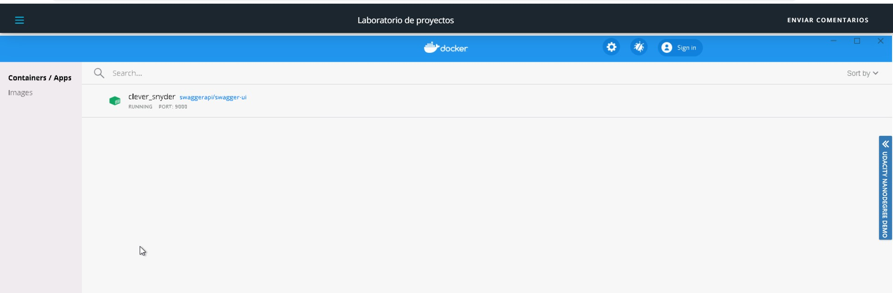

# Project2.-Operationalizing-Machine-Learning

*TODO:* Write an overview to your project.

## Architectural Diagram
*TODO*: Provide an architectual diagram of the project and give an introduction of each step. An architectural diagram is an image that helps visualize the flow of operations from start to finish. In this case, it has to be related to the completed project, with its various stages that are critical to the overall flow. For example, one stage for managing models could be "using Automated ML to determine the best model".  
  

## Key Steps

**1. Authentication**  
   I'm using the Udacity lab  
     

**2. Automated ML Experiment**  
   Registered Dataset  
     
   
   Experiment and best model 
     
   
**3. Deploy the best model**  
   Deploy best model, enabled "Authentication" and use Azure Container Instance (ACI)  
     

**4. Enable logging**  
    

**5. Swagger Documentation**  
   Log.py registered  
    
   
   Docker swagger  
     
   
     

**6. Consume model endpoints**  
   Endpoint  
     

**7. Create and publish a pipeline**  
   Pipeline  
     

**8. Documentation**  

## Screen Recording
### Authentication

## Standout Suggestions
*TODO (Optional):* This is where you can provide information about any standout suggestions that you have attempted.
