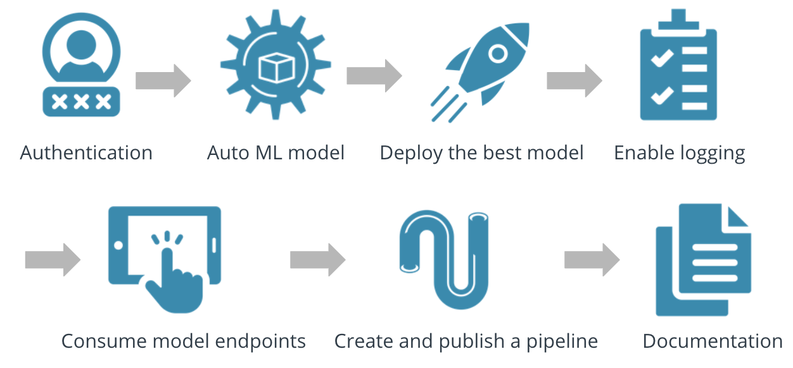

# Project2.-Operationalizing-Machine-Learning

This 2nd project is part of Udacity's Nanodegre Machine Learning Engineer with Microsoft Azure.  
Basically it is about working with the dataset provided by Banking Marketing as a dataset and using Azure, and more specifically Azure ML to configure a machine learning model and implement it, also creating an endpoint and a pipeline.  

## Architectural Diagram
As you can see in the architecture figure, the project consists of 7 main milestones (I included one more, swagger) that are described in the following **Key Steps**:  
  

## Key Steps

**1. Authentication**  
   Para que el sistema de entrega e integración continua (CI / CD) no se interrumpa, es necesario configurar y usar la autenticación con automatización. Para ello una opción es hacerlo a través de la CLI instalando la extensión ```azure-cli-ml```. Una vez comprobado que tenemos las librerías de Azure ML listas para trabajar con ellas a través de la consola, debemos realizar las siguientes comprobaciones/acciones:  
     
   En esta imagen se ve como el usuario no tiene privilegios suficientes para realizar la acción.

**2. Automated ML Experiment**  
   Registered Dataset  
     
   
   Experiment and best model 
     
   
**3. Deploy the best model**  
   Deploy best model, enabled "Authentication" and use Azure Container Instance (ACI)  
     

**4. Enable logging**  
    

**5. Swagger Documentation**  
   Log.py registered  
    
   
   Docker swagger  
     
   
     

**6. Consume model endpoints**  
   Endpoint  
     

**7. Create and publish a pipeline**  
   Pipeline  
     

**8. Documentation**  

## Screen Recording
### Authentication


## Standout Suggestions
*TODO (Optional):* This is where you can provide information about any standout suggestions that you have attempted.
