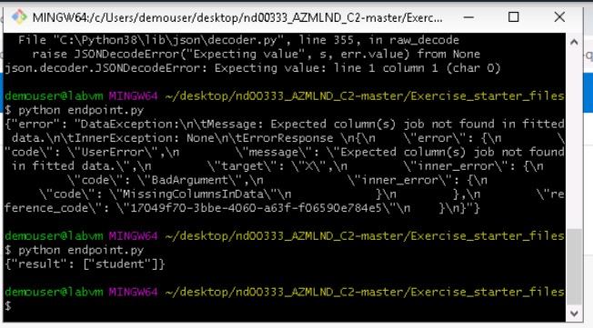

# Project2.-Operationalizing-Machine-Learning

This 2nd project is part of Udacity's Nanodegre Machine Learning Engineer with Microsoft Azure.  
Basically it is about working with the dataset provided by Banking Marketing as a dataset and using Azure, and more specifically Azure ML to configure a machine learning model and implement it, also creating an endpoint and a pipeline.  

## Architectural Diagram
As you can see in the architecture figure, the project consists of 7 main milestones (I included one more, swagger) that are described in the following **Key Steps**:  
  

## Key Steps

**1. Authentication**  
   To keep your Continuous Integration and Delivery (CI / CD) system uninterrupted, you need to configure and use authentication with automation. To do this, an option is to do it through the CLI by installing the extension ```azure-cli-ml```. Once verified that we have the Azure ML libraries ready to work with them through the console, we must perform a series of checks / actions that in my case, when carrying out the project through the Lab provided by Udacity, the result was the shown in the picture.
     
   This image shows how the user does not have sufficient privileges to perform the action.  

**2. Automated ML Experiment**  
   In this second step, an Auto ML is configured, according to the project specifications, to train a **classification model** to use it in the Dataset provided for Banking Marketing as shown in the image.  
     
   
   Once the dataset has been loaded and the column on which we want to perform the classification indicated. After finishing the training, Auto ML will tell us which model is the best. Finally, from this model, we create a new experiment as shown in the image.  
     
   
**3. Deploy the best model**  
   In this step, we deploy the best model, enabling authentication and using Azure Container Instance (ACI) as shown in the image  
     

**4. Enable logging**  
    

**5. Swagger Documentation**  
   Log.py registered  
    
   
   Docker swagger  
     
   
     

**6. Consume model endpoints**  
   Endpoint  
     

**7. Create and publish a pipeline**  
   Pipeline  
     

**8. Documentation**  

## Screen Recording
### Authentication


## Standout Suggestions
*TODO (Optional):* This is where you can provide information about any standout suggestions that you have attempted.
